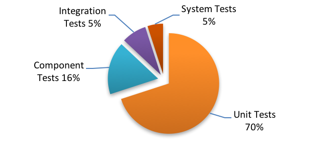

# Inject Quality In

The final stage in the roadmap is to cover components with unit tests and create what is called ‘trusted code regions’.

## Which type of tests?

There are several types of automated developer tests. The following diagram is a typical distribution of automated tests for a “healthy” product:

In case of legacy application with poor code structure, coding unit tests on method level while mocking/faking everything else would have very little ROI and would take so much time and effort before the team feels any value.

Instead, at this stage, we will concentrate on component, integration, and system tests. These are the 20% of tests which will realize 80% of the value. Also, there are some other reasons which makes such higher-level tests more appealing:

1. In the previous stage (divide & conquer), we have already prepared component interfaces, and they became ready for getting covered by tests
2. Component tests create what is called ‘trusted code regions’, and divides the overall complexity of testing among components
3. Still, the internal complexity of the component code is still high. Remember that we refrained from doing any risky refactorings so far. This is why unit tests may not be feasible at this stage

## Tracking coverage

< under development >
